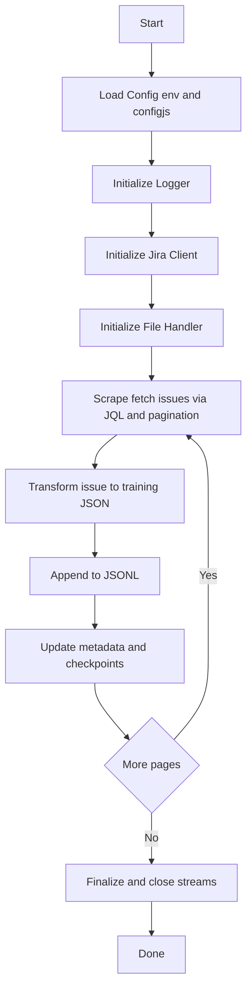
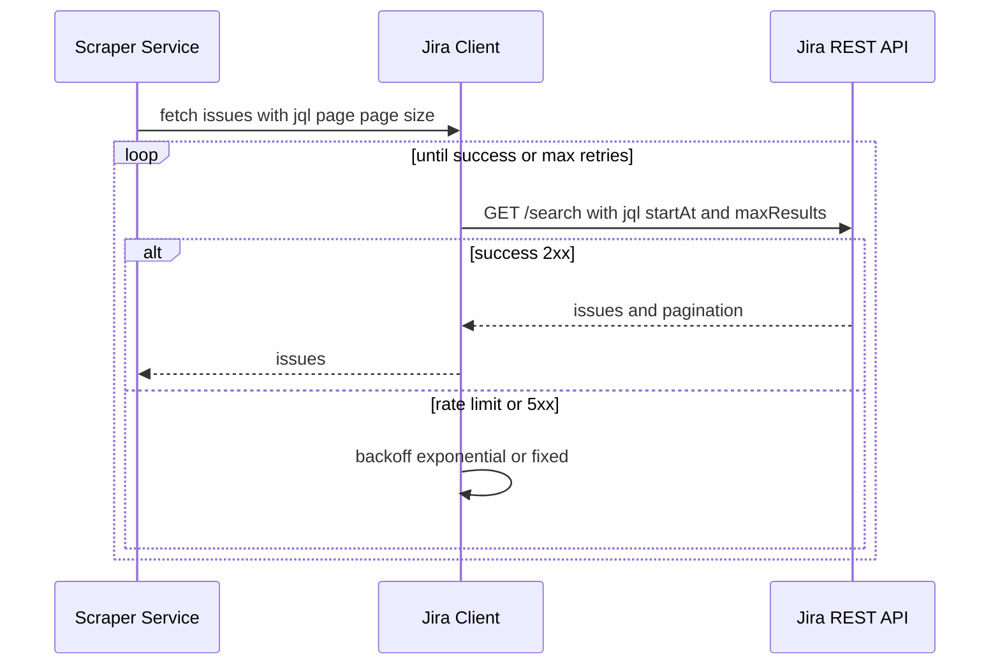
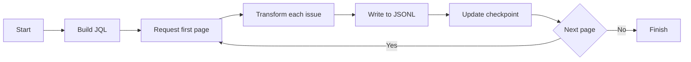
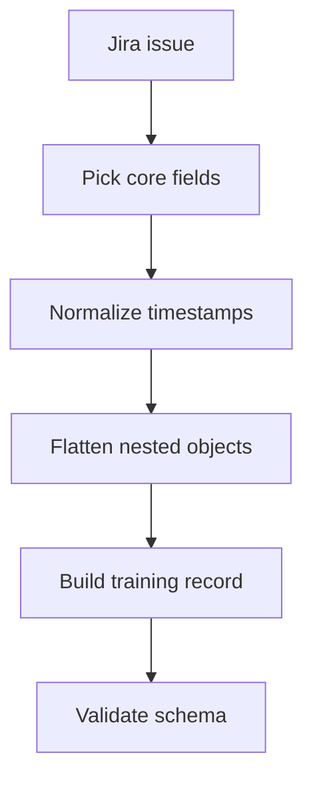

# Jira Scraper and Dataset Builder

This project scrapes issues from Jira and produces training-ready, line-delimited JSON (JSONL) artifacts. It includes:
- A robust Jira client with retry/backoff and pagination support
- A scraping service orchestrating data fetch, transform, and write
- A data transformer that normalizes Jira issues into a consistent schema
- Utilities for file handling and logging
- A cleanup script to reset the workspace for fresh scraping runs

MIT License is retained for this repository.


## Quick Start

- Install dependencies:
  - npm install
- Configure environment:
  - Copy `.env.example` to `.env` (if present) and set Jira credentials
  - Or set environment variables directly (see Configuration)
- Run a fresh scrape:
  - npm run clean
  - npm run scrape
- Outputs are written to the `output/` directory in JSONL format


## Project Structure

```
.
├── clean.js                 # Cleanup script to remove previous outputs, checkpoints, logs
├── package.json             # Scripts and dependencies
├── src/
│   ├── scraper.js           # Entrypoint to run scraping
│   ├── services/
│   │   ├── scraper.js       # Orchestrates Jira fetch, transform, write
│   │   ├── jiraClient.js    # Jira REST client with retries/backoff
│   │   └── dataTransformer.js # Converts Jira issue to training JSON
│   ├── utils/
│   │   ├── fileHandler.js   # Streaming writes to .jsonl and metadata
│   │   └── logger.js        # Structured logging
│   └── config/
│       └── config.js        # Loads env and runtime options
├── output/                  # JSONL and metadata artifacts (gitignored)
├── checkpoints/             # Checkpoint files (gitignored)
├── logs/                    # Runtime logs (gitignored)
├── .gitignore
└── LICENSE                  # MIT
```


## High-Level Workflow (End-to-End)




## Service-Level Flows

### Jira Client



Backoff implementation:
- Exponential: delay = baseDelayMs * 2^attempt (+ jitter)
- Fixed: delay = fixedDelayMs
- Configurable via environment or config.js

### Scraper Service



### Data Transformer




## Configuration

Environment variables (read by `src/config/config.js`):
- JIRA_BASE_URL: e.g., https://your-domain.atlassian.net
- JIRA_EMAIL: account email for API auth
- JIRA_API_TOKEN: API token
- JQL: JQL query used for scraping (e.g., project = ABC AND created >= -30d)
- PAGE_SIZE: page size for pagination (default 50/100 depending on implementation)
- BACKOFF_STRATEGY: exponential | fixed
- BACKOFF_BASE_DELAY_MS: base delay (ms)
- BACKOFF_MAX_RETRIES: max retry attempts
- OUTPUT_BASENAME: logical name used for outputs (e.g., KAFKA)


## Sample Jira API Request and Response

HTTP Request:
- GET {JIRA_BASE_URL}/rest/api/3/search?jql={ENCODED_JQL}&startAt=0&maxResults=50
- Headers:
  - Authorization: Basic base64(JIRA_EMAIL:JIRA_API_TOKEN)
  - Accept: application/json

Truncated sample response (fields will vary by your Jira instance):

```json
{
  "expand": "schema,names",
  "startAt": 0,
  "maxResults": 50,
  "total": 123,
  "issues": [
    {
      "id": "10001",
      "key": "ABC-123",
      "self": "https://your-domain.atlassian.net/rest/api/3/issue/10001",
      "fields": {
        "summary": "Cannot connect to Kafka broker",
        "description": {
          "type": "doc",
          "version": 1,
          "content": [{ "type": "paragraph", "content": [{ "type": "text", "text": "Connection timeout when ..." }]}]
        },
        "issuetype": { "name": "Bug" },
        "status": { "name": "Done" },
        "labels": ["kafka", "infra"],
        "created": "2024-08-21T12:34:56.789+0000",
        "updated": "2024-08-22T09:10:11.123+0000",
        "reporter": { "displayName": "Jane Doe", "emailAddress": "jane@example.com" },
        "assignee": { "displayName": "John Smith" },
        "priority": { "name": "High" },
        "project": { "key": "ABC", "name": "Platform" },
        "comment": { "comments": [{ "body": { "content": [{ "content": [{ "text": "Resolved by upgrading ..." }]}] } }] }
      }
    }
  ]
}
```


## Output Artifacts and Schemas

### Training Data JSONL
Each line is an independent JSON object.

Schema (example):
```json
{
  "id": "10001",
  "key": "ABC-123",
  "project": "ABC",
  "issue_type": "Bug",
  "status": "Done",
  "priority": "High",
  "labels": ["kafka", "infra"],
  "created_at": "2024-08-21T12:34:56.789Z",
  "updated_at": "2024-08-22T09:10:11.123Z",
  "summary": "Cannot connect to Kafka broker",
  "description": "Connection timeout when ...",
  "reporter": "Jane Doe",
  "assignee": "John Smith",
  "comments": ["Resolved by upgrading ..."],
  "source_url": "https://your-domain.atlassian.net/browse/ABC-123"
}
```

Notes:
- Rich text (ADF) descriptions/comments are flattened to plain text
- Timestamps are normalized to ISO-8601 Z (UTC) when possible
- Missing fields are omitted or set to null depending on transformer logic

### Metadata JSON
A small summary file is typically emitted alongside the JSONL. Example:

```json
{
  "dataset": "KAFKA",
  "generated_at": "2025-01-01T10:00:00.000Z",
  "total_records": 123,
  "jql": "project = ABC AND created >= -30d",
  "jira_base_url": "https://your-domain.atlassian.net",
  "schema_version": "1.0.0"
}
```

### Checkpoints
Used to resume scraping without refetching from the beginning.

```json
{
  "last_start_at": 200,
  "page_size": 50,
  "jql_hash": "3aa5...",
  "timestamp": "2025-01-01T10:05:00.000Z"
}
```


## Implementation Details

### Retrying and Backoff
- Errors considered retryable: network errors, 429 (rate limit), transient 5xx (502/503/504)
- Backoff strategies:
  - Exponential: sleep = baseDelayMs * 2^attempt + jitter(0..baseDelayMs)
  - Fixed: sleep = baseDelayMs
- Max retries configurable via BACKOFF_MAX_RETRIES
- Jitter recommended to avoid thundering herd

### Pagination
- Uses Jira `startAt` and `maxResults` parameters
- Continues until number of items returned < page size or total reached

### Transformer Notes
- Text extraction from Jira ADF (description/comment) is simplified to plain text
- Keys are stable and lower_snake_case for model training convenience
- Non-deterministic ordering (e.g., comments) is normalized if needed

### File Handling
- JSONL writes are streamed
- Metadata is updated incrementally and finalized at completion
- Checkpoints are written after each page to allow robust resume


## Commands

- npm run scrape
  - Runs the main scraping entrypoint: `src/scraper.js`
- npm run clean
  - Runs `clean.js` to remove previous outputs, logs, checkpoints
- npm run dev
  - If a server/runtime is present, runs with `nodemon`
- npm test
  - Project test entrypoint


## How to Run a Fresh Scrape

1) Configure env (JIRA_BASE_URL, JIRA_EMAIL, JIRA_API_TOKEN, JQL)
2) Reset workspace: npm run clean
3) Start scraping: npm run scrape
4) Check `output/` for `*_training_data.jsonl` and `*_metadata.json`


## Troubleshooting

- 401/403: Verify API token and that account has permission to run JQL
- 429: Rate limited; increase BACKOFF_BASE_DELAY_MS or reduce PAGE_SIZE
- 5xx: Usually transient; the client will retry with backoff
- Empty output: Confirm JQL and permissions; try a simpler JQL first


## .gitignore Highlights

The repo is already configured to ignore volatile artifacts to make pushing to remote easier:
- output/ and *.jsonl
- checkpoints/ and *.checkpoint.json
- logs/ and *.log
- *_metadata.json
- node_modules/
- .env


## Contributing

- Keep changes small and well-documented in commit messages
- Prefer general, reusable transformers over hard-coded project specifics
- Add or update unit tests where applicable


## License

This project is licensed under the MIT License. See LICENSE for details.
